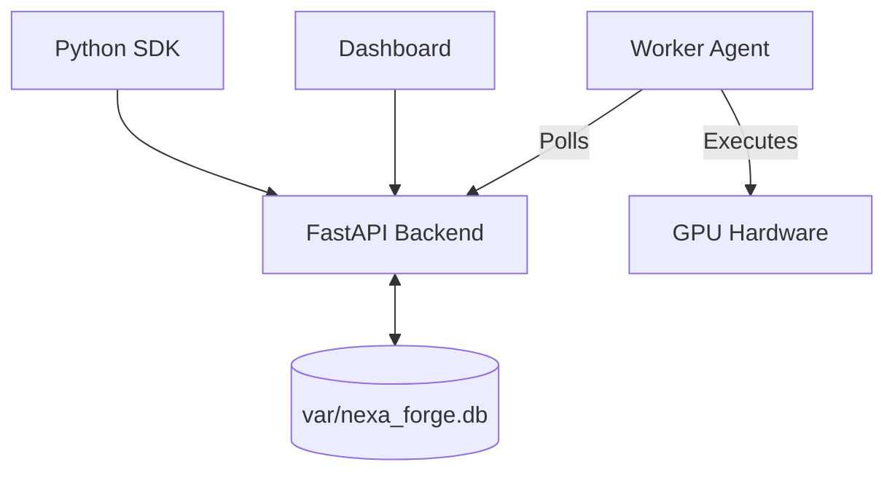

# Nexa Forge Platform Guide

**Nexa Forge** is the API-first orchestration layer for the NexaCompute ecosystem. It automates the lifecycle of data generation, model distillation, training, and deployment by coordinating ephemeral GPU workers.

---

## Architecture

The platform follows a control-plane / compute-plane architecture:



### Components

1.  **Backend API** (`src/nexa_compute/api/`)
    *   FastAPI server handling job submission, worker registration, and state management.
    *   Exposes endpoints at `/api/jobs`, `/api/workers`.

2.  **Worker Agent** (`src/nexa_compute/api/worker_agent.py`)
    *   A pull-based agent that runs on GPU nodes.
    *   Polls the API for pending jobs (`/api/workers/next_job`).
    *   Executes tasks using the `src/workers/worker.py` logic.

3.  **SDK** (`sdk/nexa_forge/`)
    *   Client library for interacting with the API programmatically.

---

## Getting Started

### 1. Start the Control Plane (Backend)

Run the API server to accept jobs and manage workers.

```bash
# Install dependencies
pip install -r requirements.txt

# Start FastAPI
export PYTHONPATH=$PYTHONPATH:$(pwd)/src
uvicorn src.nexa_compute.api.main:app --reload --port 8000
```

The API will be available at `http://localhost:8000`. Swagger docs at `/docs`.

### 2. Start a Compute Worker

On your GPU node (or local machine for testing), start the worker agent.

```bash
# Configure connection to Backend
export NEXA_API_URL="http://localhost:8000/api"
export WORKER_ID="gpu-worker-01"

# Start the agent
python src/nexa_compute/api/worker_agent.py
```

The worker will register itself and begin polling for jobs.

### 3. Use the SDK

Install the SDK and submit jobs.

```bash
pip install -e sdk/
```

```python
from nexa_forge import NexaForgeClient

client = NexaForgeClient(api_url="http://localhost:8000/api")

# 1. Data Generation
client.generate(domain="physics", num_samples=1000)

# 2. Model Distillation
client.distill(
    teacher_model="gpt-4o",
    student_model="llama-3-8b",
    dataset_uri="s3://nexa-data/physics_v1.parquet"
)

# 3. Training
client.train(
    model_id="llama-3-8b-physics",
    dataset_uri="s3://nexa-data/distilled_physics.parquet",
    epochs=3
)
```

---

## Job Types & Pipelines

The platform automates the following `JobType`s:

### Data Audit (`audit`)
*   **Function**: `src.nexa.data_quality.audit_dataset`
*   **Input**: Dataset URI.
*   **Output**: Quality report, integrity checks.

### Distillation (`distill`)
*   **Function**: `src.nexa.distillation.run_distillation`
*   **Input**: Teacher model, prompt template, input data.
*   **Output**: SFT-ready dataset (Questions/Answers).

### Training (`train`)
*   **Function**: `src.nexa.training.run_training`
*   **Input**: Base model, SFT dataset, hyperparameters.
*   **Output**: Fine-tuned model checkpoint.

### Evaluation (`evaluate`)
*   **Function**: `src.nexa.evaluation.run_evaluation`
*   **Input**: Model checkpoint, benchmark suite.
*   **Output**: Metrics scores (Accuracy, F1, Judge Score).

### Deployment (`deploy`)
*   **Function**: `src.nexa.deployment.deploy_model`
*   **Input**: Model checkpoint, target region.
*   **Output**: Inference endpoint URL.

---

## Operational Notes

*   **Database**: Uses SQLite (`var/nexa_forge.db`) by default. Configure `DATABASE_URL` for PostgreSQL or another backend.
*   **Logs**: Worker logs are streamed back to the API and stored in the job record.
*   **Concurrency**: The API handles job queuing; workers handle execution. Scale by adding more Worker Agents.

