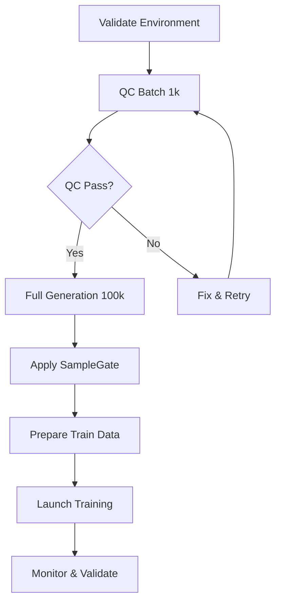

# NexaCompute Quick Start Guide

## Today's Mission (2025-11-04)
Generate full dataset (10k-100k samples) and attempt training on 2×A100.

## 🚀 Quick Commands

### 1. Validate Environment
```bash
./scripts/validate_environment.sh
```

### 2. Run QC Batch (1k samples, ~10 min)
```bash
# With tmux (recommended)
./scripts/tmux_data_gen.sh 1 1000

# Direct execution
python scripts/run_batch_generation.py \
    --config batches/teacher_gen_v1.yaml \
    --input data/raw/scientific_corpus_325M.jsonl \
    --num-batches 1 \
    --batch-size 1000
```

### 3. Run Full Generation (100k samples, ~16-18 hrs)
```bash
# Start in tmux session
./scripts/tmux_data_gen.sh 10 10000

# Monitor progress
tmux attach-session -t data_gen

# Detach: Ctrl+B then D
```

### 4. Apply Filtering
```bash
python -m nexa_distill.sample_gate \
    --input data/processed/distillation/generated_combined.parquet \
    --output data/processed/distillation/filtered_samples.parquet \
    --rejections data/processed/distillation/rejections.parquet \
    --report data/processed/distillation/filter_report.md

# View report
cat data/processed/distillation/filter_report.md
```

### 5. Launch Training
```bash
# With tmux (recommended)
./scripts/tmux_training.sh

# Monitor
tmux attach-session -t training
```

### 6. Complete Pipeline (automated)
```bash
./scripts/run_full_pipeline.sh 10 10000
```

## 📋 Tmux Cheat Sheet

| Command | Description |
|---------|-------------|
| `tmux ls` | List sessions |
| `tmux attach -t SESSION` | Attach to session |
| `Ctrl+B then D` | Detach from session |
| `tmux kill-session -t SESSION` | Kill session |
| `Ctrl+B then [` | Enter scroll mode |
| `q` | Exit scroll mode |

## 📁 Key Files

### Configurations
- `batches/teacher_gen_v1.yaml` - Generation config
- `nexa_train/configs/baseline_qlora.yaml` - Training config

### Scripts
- `scripts/tmux_data_gen.sh` - Data generation launcher
- `scripts/tmux_training.sh` - Training launcher
- `scripts/run_full_pipeline.sh` - Complete pipeline
- `scripts/validate_environment.sh` - Environment check

### Core Modules
- `nexa_eval/rubrics/judge_f.py` - Factual accuracy judge
- `nexa_eval/rubrics/judge_r.py` - Reasoning & safety judge
- `nexa_distill/sample_gate.py` - Quality filtering
- `scripts/run_batch_generation.py` - Generation orchestrator

### Documentation
- `docs/TODAY_EXECUTION_PLAN.md` - Detailed execution plan
- `QUICK_START.md` - This file

## 🔍 Monitoring

### Check Generation Progress
```bash
# Attach to tmux
tmux attach-session -t data_gen

# Or tail logs
tail -f logs/data_gen/run_*.log

# Check manifest
tail -f data/processed/distillation/generation_manifest.jsonl
```

### Check Training Progress
```bash
# Attach to tmux
tmux attach-session -t training

# Or tail logs
tail -f logs/training/run_*.log

# TensorBoard
tensorboard --logdir logs/tensorboard --port 6006
```

### Check GPU Usage
```bash
watch -n 1 nvidia-smi
```

## ⚠️ Troubleshooting

### API Rate Limits
Edit `batches/teacher_gen_v1.yaml`:
```yaml
max_concurrent_requests: 20  # Reduce from 50
```

### OOM During Training
Edit `nexa_train/configs/baseline_qlora.yaml`:
```yaml
per_device_train_batch_size: 2  # Reduce from 4
gradient_accumulation_steps: 8   # Increase from 4
```

### Tmux Session Exists
```bash
tmux kill-session -t data_gen  # or training
```

## 💰 Cost Estimates

| Task | Cost | Duration |
|------|------|----------|
| QC Batch (1k) | $0.50-0.75 | ~10 min |
| Full Gen (100k) | $50-75 | ~16-18 hrs |
| Training (2×A100) | $9 | ~3 hrs |
| **Total** | **$60-85** | **~19-21 hrs** |

## ✅ Success Criteria

### Data Generation
- ✅ 100k samples generated
- ✅ Judge-F mean ≥ 75
- ✅ Judge-R mean ≥ 75
- ✅ Acceptance rate ≥ 70%

### Training
- ✅ Training starts without errors
- ✅ Throughput ≥ 12k tokens/sec
- ✅ Training loss decreases
- ✅ Checkpoints saved

## 🎯 Today's Workflow



## 📞 Need Help?

See detailed execution plan:
```bash
cat docs/TODAY_EXECUTION_PLAN.md
```

Check module documentation:
```bash
ls -la docs/Overview_of_Project/
```

---

**Quick Start:** `./scripts/validate_environment.sh && ./scripts/run_full_pipeline.sh`

