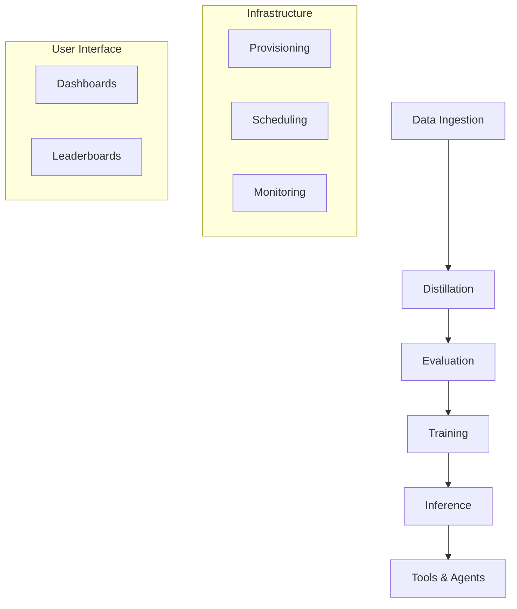

# NexaCompute Pipelines

Welcome to the core documentation for NexaCompute's data, training, and inference pipelines. This guide serves as the central entry point for understanding how the platform's modular components interact to transform raw data into deployed intelligence.

## 🏗️ Architecture Overview

The platform is organized into **7 specialized pipelines**, each handling a distinct stage of the model lifecycle.



## 📚 Pipeline Documentation

| Pipeline | Scope | Key Modules | Documentation |
| :--- | :--- | :--- | :--- |
| **[Data Engineering](./DATA.md)** | Ingestion, Validation, Synthetic Data | `nexa_data` | [Read Docs](./DATA.md) |
| **[Distillation](./DISTILLATION.md)** | Teacher Generation, Knowledge Transfer | `nexa_distill` | [Read Docs](./DISTILLATION.md) |
| **[Evaluation](./EVALUATION.md)** | LLM-as-a-Judge, Benchmarking | `nexa_eval` | [Read Docs](./EVALUATION.md) |
| **[Training](./TRAINING.md)** | SFT, DPO, Pretraining, FSDP | `nexa_train` | [Read Docs](./TRAINING.md) |
| **[Inference](./INFERENCE.md)** | Model Serving, Spectral Analysis | `nexa_inference` | [Read Docs](./INFERENCE.md) |
| **[Tools](./TOOLS.md)** | Sandboxed Execution, Agent APIs | `nexa_tools` | [Read Docs](./TOOLS.md) |
| **[Infrastructure](./INFRASTRUCTURE.md)** | Scheduling, Cost, Containerization | `nexa_infra` | [Read Docs](./INFRASTRUCTURE.md) |
| **[User Interface](./UI.md)** | Dashboards, Inspection Tools | `nexa_ui` | [Read Docs](./UI.md) |

---

## 🚀 Execution Guide

For end-to-end execution, we recommend using the orchestrated tmux workflow. This manages the dependencies between data generation, filtering, packaging, and training.

### Quick Start

**Launch the full pipeline:**
```bash
bash scripts/shell/orchestration/launch_pipeline.sh
```

This script initializes **4 tmux sessions**, ensuring that each stage waits for the previous one to complete (where applicable) or runs in parallel for maximum throughput.

### Manual Stage Execution

If you need granular control, you can run individual stages manually:

#### 1. Data Generation (`data_gen`)
Generates reasoning traces from the Teacher model.
```bash
python scripts/python/data_processing/run_full_data_gen.py
```

#### 2. Filtering (`filtering`)
Applies heuristic filters and the "SampleGate" LLM judge to remove low-quality data.
```bash
python scripts/python/data_processing/run_filtering.py
```

#### 3. Packaging (`packaging`)
Converts the filtered dataset into the standardized JSONL/Parquet format for SFT.
```bash
python scripts/python/deployment/run_packaging.py
```

#### 4. Training (`training`)
Launches the training job (supports both single-node and distributed setups).
```bash
bash scripts/shell/training/run_training.sh nexa_train/configs/baseline_distill.yaml true
```

---

## 📂 Data Flow & Artifacts

The pipeline enforces a strict directory structure for reproducibility.

| Stage | Input Path | Output Path |
| :--- | :--- | :--- |
| **Distillation** | `data/processed/distillation/teacher_inputs/` | `data/processed/distillation/teacher_outputs/` |
| **Filtering** | `data/processed/distillation/teacher_outputs/` | `data/processed/distillation/filtered/` |
| **Packaging** | `data/processed/distillation/filtered/` | `data/processed/training/sft_dataset.jsonl` |
| **Training** | `data/processed/training/` | `artifacts/checkpoints/<run_id>/` |
| **Evaluation** | `artifacts/checkpoints/<run_id>/` | `results/evaluation/reports/` |

## 🔧 Configuration

Each pipeline stage is controlled by YAML configuration files.

*   **Distillation**: `nexa_distill/configs/distill_config.yaml` (Model selection, prompting)
*   **Filtering**: `nexa_distill/configs/filters.yaml` (Judge thresholds, heuristics)
*   **Training**: `nexa_train/configs/` (Hyperparameters, hardware settings)
*   **Infrastructure**: `nexa_infra/configs/` (Slurm partitions, docker images)

## 🛠️ Troubleshooting

### Session Management
Use `tmux` to manage long-running jobs:
*   `tmux list-sessions`: See active pipeline stages.
*   `tmux attach -t <session_name>`: View live logs.
*   `ctrl+b` then `d`: Detach without stopping the job.

### Logging
All stages write structured logs to the `logs/` directory.
*   **Generation**: `logs/data_gen.log`
*   **Training**: `logs/training.log`
*   **System**: `logs/system_monitor.log` (GPU/CPU usage)
